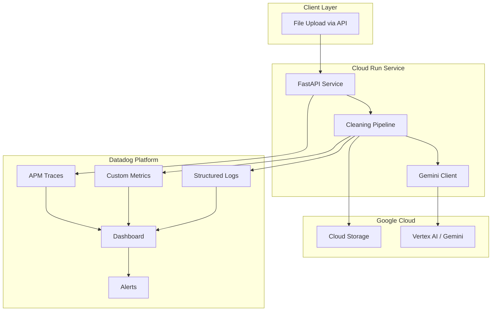

# CleanMyData Hackathon Pivot: AI-Assisted Data Cleaning with Full Observability

## Target Architecture



---

## 1. Architecture Evolution (Step-by-Step)

### Phase 1: HTTP API Layer (Day 1)

Add a FastAPI wrapper around your existing cleaning pipeline.| Action | Details ||--------|---------|| **Add** | `cleanmydata/api.py` - FastAPI app with `/clean` POST endpoint || **Add** | `Dockerfile` + `cloudbuild.yaml` for Cloud Run deployment || **Keep** | [`cleanmydata/clean.py`](cleanmydata/clean.py) core logic intact |Endpoint design:

```python
POST /clean
    - Accepts: multipart file upload (CSV/XLSX)
    - Returns: { "job_id": "...", "status": "processing" }

GET /clean/{job_id}
    - Returns: { "status": "completed", "download_url": "...", "summary": {...}, "ai_suggestions": [...] }
```


### Phase 2: Datadog Integration (Day 1-2)

Instrument before adding AI to establish baseline telemetry.| Action | Details ||--------|---------|| **Add** | `ddtrace` for automatic APM instrumentation || **Refactor** | [`cleanmydata/utils/io.py`](cleanmydata/utils/io.py) to emit structured JSON logs via `structlog` + Datadog formatter || **Add** | Custom metrics emission in [`cleanmydata/clean.py`](cleanmydata/clean.py) pipeline steps |

### Phase 3: Gemini AI Integration (Day 2-3)

Add AI as a data quality advisor, not a transformer.| Action | Details ||--------|---------|| **Add** | `cleanmydata/ai/gemini.py` - Vertex AI client for Gemini || **Add** | `cleanmydata/ai/prompts.py` - Prompt templates for data quality analysis || **Refactor** | Pipeline to call Gemini post-cleaning for suggestions |

### Phase 4: Cloud Run Deployment (Day 3)

| Action | Details ||--------|---------|| **Add** | Cloud Run service configuration || **Add** | GCS bucket for file storage (upload/download) || **Add** | Secret Manager for API keys (Datadog, Vertex AI) |---

## 2. Where Datadog Fits Naturally

Datadog observability aligns with pipeline stages:| Pipeline Stage | Datadog Component | What You Capture ||---------------|-------------------|------------------|| File Upload | **Trace span** | Upload latency, file size || Schema Detection | **Trace span + Log** | Column types detected, schema anomalies || Each cleaning step | **Trace span + Metric** | Duration, rows affected, errors || Gemini API call | **Trace span + Log** | Latency, tokens used, suggestions returned || Full pipeline | **Trace (parent)** | End-to-end duration, success/failure || Aggregate | **Dashboard** | Throughput, error rates, AI usage patterns |Key insight: Your existing 6-step pipeline (duplicates, normalize, text, format, outliers, missing) becomes 6 traced spans with metrics per step.---

## 3. Minimum Metrics, Logs, and Traces

### Traces (APM)

```javascript
cleanmydata.api.clean (parent span)
  ├── cleanmydata.io.read_file
  ├── cleanmydata.clean.remove_duplicates
  ├── cleanmydata.clean.normalize_columns
  ├── cleanmydata.clean.clean_text
  ├── cleanmydata.clean.standardize_formats
  ├── cleanmydata.clean.handle_outliers
  ├── cleanmydata.clean.fill_missing
  ├── cleanmydata.ai.gemini_analyze (AI span)
  └── cleanmydata.io.write_file
```


### Custom Metrics (Minimum Viable)

| Metric Name | Type | Tags | Purpose ||-------------|------|------|---------|| `cleanmydata.rows.processed` | count | `step`, `job_id` | Track throughput || `cleanmydata.duplicates.removed` | count | `job_id` | Quality improvement signal || `cleanmydata.outliers.handled` | count | `job_id`, `method` | Shows pipeline impact || `cleanmydata.missing.filled` | count | `job_id` | Data completeness signal || `cleanmydata.gemini.latency` | histogram | `prompt_type` | AI performance tracking || `cleanmydata.gemini.suggestions` | count | `category` | AI value delivered || `cleanmydata.pipeline.duration` | histogram | `status` | Overall performance || `cleanmydata.errors` | count | `step`, `error_type` | Reliability tracking |

### Structured Logs

```json
{
  "timestamp": "2025-12-23T10:30:00Z",
  "level": "info",
  "service": "cleanmydata",
  "job_id": "abc123",
  "step": "remove_duplicates",
  "rows_before": 10000,
  "rows_after": 9850,
  "duration_ms": 245,
  "dd": {
    "trace_id": "...",
    "span_id": "..."
  }
}
```

---

## 4. Datadog Dashboard and Detection Rules

### Dashboard Layout (Demo-Ready)

Create a single dashboard with 4 sections:**Section 1: Pipeline Health (Top Row)**

- Request rate (timeseries)
- Error rate (timeseries)
- P95 latency (timeseries)

**Section 2: Data Quality Impact (Middle Row)**

- Duplicates removed (bar chart, last 24h)
- Outliers handled (bar chart)
- Missing values filled (bar chart)
- Rows processed (counter)

**Section 3: AI Component (Middle Row)**

- Gemini API latency (histogram)
- Suggestions generated by category (pie chart)
- AI call success rate (single value)

**Section 4: Live Request Trace (Bottom)**

- Flame graph of current/recent request

### Detection Rules (Monitors)

| Monitor | Condition | Alert ||---------|-----------|-------|| High Error Rate | Error rate > 5% for 5 min | Slack / PagerDuty || Slow Pipeline | P95 latency > 30s for 5 min | Warning || Gemini Degradation | Gemini latency > 5s for 3 min | Warning || AI Suggestions Dropped | Suggestion rate drops 50% | Info |---

## 5. Positioning Gemini as AI Quality Component

### What Gemini DOES (Advisor Role)

Gemini analyzes the cleaned dataset and provides actionable suggestions:

1. **Schema Recommendations**: "Column 'phone' contains mixed formats. Consider standardizing to E.164."
2. **Data Quality Warnings**: "15% of 'email' values appear invalid. Review rows 234, 567, ..."
3. **Business Rule Hints**: "Column 'status' has 47 unique values. Consider consolidating to standard categories."
4. **Outlier Context**: "Outliers in 'price' column may represent wholesale vs retail. Verify before capping."

### What Gemini DOES NOT Do

- Does not directly modify data (your deterministic pipeline does that)
- Does not make irreversible decisions
- Does not replace rule-based cleaning

### Implementation Pattern

```python
# In cleanmydata/ai/gemini.py
async def analyze_data_quality(df: pd.DataFrame, cleaning_summary: dict) -> list[Suggestion]:
    """Post-cleaning AI analysis - advisory only."""

    # Sample data for context (never send full dataset)
    sample = df.head(100).to_dict()
    schema = {col: str(df[col].dtype) for col in df.columns}

    prompt = build_analysis_prompt(sample, schema, cleaning_summary)

    response = await vertex_client.generate_content(prompt)
    suggestions = parse_suggestions(response)

    return suggestions
```


### Why This Positioning Works

- AI is **additive**, not a black box replacing your logic
- Deterministic cleaning is traceable (judges can verify)
- AI suggestions are logged and traceable in Datadog
- Demonstrates "human in the loop" best practice

---

## 6. Codebase Changes

### KEEP (Core Value)

| File | Reason ||------|--------|| [`cleanmydata/clean.py`](cleanmydata/clean.py) | Core pipeline logic - well-structured, 6 clear steps || [`cleanmydata/models.py`](cleanmydata/models.py) | `CleaningResult` dataclass - extend for AI suggestions || [`cleanmydata/config.py`](cleanmydata/config.py) | `CleaningConfig` - add AI/observability options || [`cleanmydata/utils/io.py`](cleanmydata/utils/io.py) | I/O logic - add GCS support || [`cleanmydata/exceptions.py`](cleanmydata/exceptions.py) | Exception hierarchy - extend with API errors |

### REFACTOR

| File | Changes ||------|---------|| [`cleanmydata/clean.py`](cleanmydata/clean.py) | Add trace decorators to each step; emit metrics after each step || [`cleanmydata/utils/__init__.py`](cleanmydata/utils/__init__.py) | Add `observability.py` module for Datadog helpers || [`pyproject.toml`](pyproject.toml) | Add new dependencies: `fastapi`, `uvicorn`, `ddtrace`, `google-cloud-aiplatform` |

### ADD (New Files)

| File | Purpose ||------|---------|| `cleanmydata/api.py` | FastAPI application with `/clean` endpoint || `cleanmydata/ai/__init__.py` | AI module init || `cleanmydata/ai/gemini.py` | Vertex AI Gemini client || `cleanmydata/ai/prompts.py` | Prompt templates for data analysis || `cleanmydata/utils/observability.py` | Datadog metrics/logging helpers || `cleanmydata/utils/storage.py` | GCS upload/download helpers || `Dockerfile` | Container for Cloud Run || `cloudbuild.yaml` | Cloud Build config || `.env.example` | Environment variable template |---

## 7. Why This Scores Well with Judges

### Datadog Challenge Alignment

| Criterion | How You Deliver ||-----------|-----------------|| Meaningful observability | Every pipeline step is traced with business metrics, not just infra metrics || Dashboard tells a story | Data quality improvement visible in real-time || AI + Observability synergy | Gemini suggestions are traced and measured - you can show AI ROI || Production-ready patterns | Error handling, structured logging, alerting |

### Demo Strategy (3 Minutes)

1. **0:00-0:30**: Upload dirty CSV via API, show trace starting in Datadog
2. **0:30-1:30**: Walk through flame graph as pipeline processes - highlight each step's metrics
3. **1:30-2:15**: Show AI suggestions in response + Gemini span metrics
4. **2:15-2:45**: Dashboard view - quality metrics, AI latency, error rate
5. **2:45-3:00**: Trigger alert threshold, show monitor firing

### Differentiation

- Not just "we added Datadog" - observability is **integral to understanding AI behavior**
- Gemini provides value without being a black box
